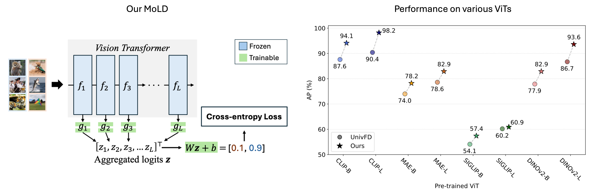

# MoLD: Mixture of Layers for AI-Generated Image Detection

Official PyTorch implementation of the paper "Rethinking the Use of Vision Transformers for AI-Generated Image Detection".

[](https://arxiv.org/abs/)


<div style="text-align: center;">
  
</div>

## Overview

Rich feature representations from CLIP-ViT are widely used in AI-generated image detection, but most methods only leverage final-layer features. We systematically analyze layer-wise features and find that earlier layers provide more localized and generalizable features, often outperforming final-layer features.

Different layers capture distinct aspects of the data, each contributing uniquely to AI-generated image detection. We introduce MoLD (Mixture of Layers for AI-generated image Detection), a novel adaptive method that dynamically integrates features from multiple ViT layers using a gating-based mechanism.

### Key Contributions

- Systematic analysis of layer-wise features in Vision Transformers for fake image detection
- A novel mechanism that adaptively integrates features from multiple ViT layers
- Significant improvements in detection performance and generalization across diverse generative models
- Demonstrated robustness in real-world scenarios
- Scalable and versatile approach applicable to other pre-trained ViTs such as DINOv2


## Requirements

- Python >= 3.9, < 3.13
- PyTorch 2.5.1
- CUDA-compatible GPU


## Installation

```bash
git clone https://github.com/nahyeonkaty/mold
cd mold
pip install -e .
```

### Optional Dependencies

For experiment tracking with Weights & Biases:
```bash
pip install wandb
```


## Project Structure

```
mold/
├── mold/                          # Main package
│   ├── detector.py               # MoLD detector implementation
│   ├── validation.py             # Validation utilities
│   ├── earlystop.py              # Early stopping implementation
│   ├── utils.py                  # Utility functions
│   ├── data/                     # Dataset handling
│   │   ├── datasets.py           # Dataset classes
│   │   └── dataset_paths.py      # Dataset path configurations
│   ├── models/                   # Model architectures
│   │   ├── dino_models.py        # DINOv2 model wrapper
│   │   ├── imagenet_models.py    # ImageNet pretrained models
│   │   └── clip/                 # CLIP model utilities
│   ├── networks/                 # Network components
│   │   ├── trainer.py            # Training logic
│   │   └── base_model.py         # Base model class
│   └── options/                  # Command-line options
│       ├── base_options.py       # Base options
│       └── train_options.py      # Training-specific options
├── scripts/                      # Training and evaluation scripts
│   ├── train.py                  # Main training script
│   ├── validate.py               # Validation script
│   ├── train_adm.sh              # Training script for ADM dataset
│   └── test_adm.sh               # Testing script for ADM dataset
├── checkpoints/                  # Saved model checkpoints
└── notebooks/                    # Jupyter notebooks for analysis
```


## Dataset Preparation

### Supported Dataset Formats

The codebase supports multiple dataset modes:

1. **custom**: For GenImage-style datasets with the following structure:

```
data_root/
├── <generator_name>/
│   ├── train/
│   │   ├── real/
│   │   └── fake/
│   └── val/
│       ├── real/
│       └── fake/
```

2. **wang2020**: For CNNDetection dataset format with `0_real` and `1_fake` subfolders

3. **progan_custom**: For ProGAN-style datasets


## Training

### Basic Training

```bash
./scripts/train_adm.sh <gpu_id>
```

Before running, edit `scripts/train_adm.sh` to set your data directory:
```bash
DATA_ROOT="/path/to/your/dataset"
```

### Training with Custom Options

```bash
CUDA_VISIBLE_DEVICES=0 python scripts/train.py \
    --batch_size 128 \
    --fix_backbone \
    --niter 100 \
    --arch "CLIP:openai/clip-vit-large-patch14" \
    --data_mode custom \
    --data_root /path/to/dataset \
    --gm adm \
    --expname my_experiment
```

### Key Training Arguments

| Argument | Default | Description |
|-||-|
| `--arch` | `res50` | Model architecture (e.g., `CLIP:openai/clip-vit-large-patch14`, `DINOv2:LARGE`) |
| `--batch_size` | 256 | Training batch size |
| `--niter` | 100 | Number of training epochs |
| `--lr` | 0.0001 | Learning rate |
| `--fix_backbone` | False | Freeze the backbone network |
| `--data_mode` | `ours` | Dataset mode (`custom`, `wang2020`, `progan_custom`) |
| `--data_root` | None | Root directory for custom datasets |
| `--gm` | `none` | Generative model name for dataset organization |
| `--expname` | `exp` | Experiment name for saving checkpoints |


## Evaluation

### Basic Evaluation

```bash
./scripts/test_adm.sh <gpu_id> <generator_name> <skip_idx>
```

Before running, edit `scripts/test_adm.sh` to set your data directory.

### Evaluation with Custom Options

```bash
CUDA_VISIBLE_DEVICES=0 python scripts/validate.py \
  --real_path /path/to/real/images \
  --fake_path /path/to/fake/images \
  --data_mode custom \
  --ckpt checkpoints/your_model/earlystop_best.pth \
  --arch "CLIP:openai/clip-vit-large-patch14" \
  --batch_size 128
```

### Key Evaluation Arguments

| Argument | Default | Description |
|-||-|
| `--ckpt` | - | Path to model checkpoint |
| `--real_path` | None | Path to real images |
| `--fake_path` | None | Path to fake images |
| `--max_sample` | 1000 | Maximum samples per class |
| `--crop_size` | 224 | Image crop size |
| `--jpeg_quality` | None | JPEG compression quality for robustness testing |
| `--gaussian_sigma` | None | Gaussian blur sigma for robustness testing |
| `--resize_scale` | None | Resize scale for robustness testing |


## Supported Architectures

### CLIP Models
- `CLIP:openai/clip-vit-large-patch14` (recommended)
- `CLIP:openai/clip-vit-base-patch16`
- `CLIP:openai/clip-vit-base-patch32`

### DINOv2 Models
- `DINOv2:LARGE`
- `DINOv2:BASE`

### ImageNet Pretrained Models
- `Imagenet:vit_b_16`
- `Imagenet:vit_b_32`
- `Imagenet:vit_l_16`
- `Imagenet:vit_l_32`


## Model Architecture

MoLD extracts features from all transformer layers and uses a learnable gating mechanism to combine them:

```
Input Image
    |
    v
ViT Backbone (frozen)
    |
    v
[Layer 1, Layer 2, ..., Layer N] CLS tokens
    |
    v
FC1 (hidden_size -> 512) + GELU
    |
    v
FC2 (512 -> 1) per layer
    |
    v
FC3 (num_layers -> 1) Gating
    |
    v
Binary Classification Output
```


## Checkpoints

Trained checkpoints are saved in `checkpoints/<expname>/`:
- `earlystop_best.pth`: Best model based on validation accuracy
- `model_epoch_<N>.pth`: Model at epoch N
- `model_epoch_best.pth`: Best model (same as earlystop_best.pth)
- `loss.csv`: Training loss log
- `opt.txt`: Training configuration


## Robustness Testing

The validation script supports testing model robustness under various perturbations:

```bash
# JPEG compression robustness
python scripts/validate.py --jpeg_quality 75 ...

# Gaussian blur robustness
python scripts/validate.py --gaussian_sigma 2 ...

# Resize robustness
python scripts/validate.py --resize_scale 0.5 ...
```


## License

This project is released under the license specified in the LICENSE file.


## Citation

If you find this work useful for your research, please cite our paper:

```bibtex
@article{park2025mold,
  title={Rethinking the Use of Vision Transformers for AI-Generated Image Detection},
  author={Park, NaHyeon and Kim, Kunhee and Choe, Junseok and Shim, Hyunjung},
  journal={arXiv preprint},
  year={2025}
}
```


## Acknowledgements

This codebase builds upon the following works:
- [CLIP](https://github.com/openai/CLIP)
- [DINOv2](https://github.com/facebookresearch/dinov2)
- [CNNDetection](https://github.com/peterwang512/CNNDetection)


## Contact

For questions or issues, please open an issue on GitHub or contact:
- NaHyeon Park: julia19@kaist.ac.kr
- Kunhee Kim: kunhee.kim@kaist.ac.kr
